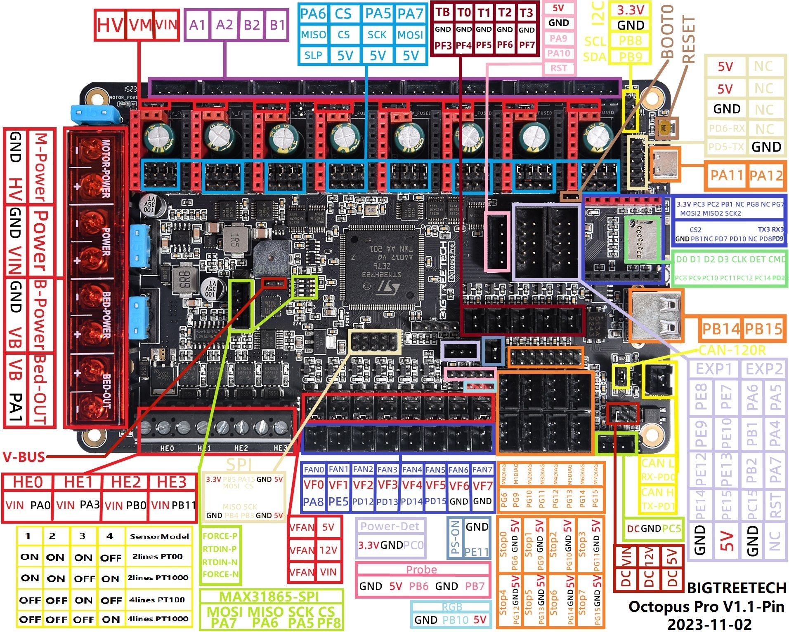

# FlyingBear Ghost 6 modifications for Octopus-Pro and CHC-XL
## What to buy
 * Octopus Pro H723
 * TMC2240 x5
 * "Nail" Fan 40x15 24v x2
 * "Nail" Fan 40x20 24v
 * Order custom bed heater using [drawings/heater.png](drawings/heater.png) (220v 500w) (may be here, write message to seller https://aliexpress.ru/store/911266084)
 * SSR-40-DA Relay
 * CHC-XL
 * 5Aplusreprap for PRUSAI3 MK8 (https://aliexpress.ru/item/1005003334340394.html) [images/feeder.jpg](images/feeder.jpg)
 * Nema 14 36mm (36STH20-1004HG)
 * 300x300x3 acrylic glass
 * 3D Touch [images/3dtouch.jpg](images/3dtouch.jpg)
 * 120mm FAN (PC FAN)
 * LEDS (or use Built in)

## Connection
 * X - MOTOR0
 * Y - MOTOR1
 * Z - MOTOR3
 * Extruder - MOTOR4
 * Bed Heater (220v through Relay SSR-40-DA) - HE0
 * Bead Heater Temperature Sensor - TB
 * Hotend Heater - HE1
 * Hotend Temperature Sensor - T0
 * Hotend Fan ("Nail" Fan 40x20 24v) - FAN0 (Switch VFAN to 24v)
 * Model cool fan ("Nail" Fan 40x15 24v x2) - FAN1 (Switch VFAN to 24v)
 * Chamber fan (Built in) - FAN2 (Switch VFAN to 24v)
 * LED light - FAN3 (Switch VFAN to LEDs voltage, built in LEDs are 5v)
 * Electronics fan (120mm FAN) - FAN2 (Switch VFAN to 12v)
 * 3D Touch - PROBE

(will be updated soon...)
